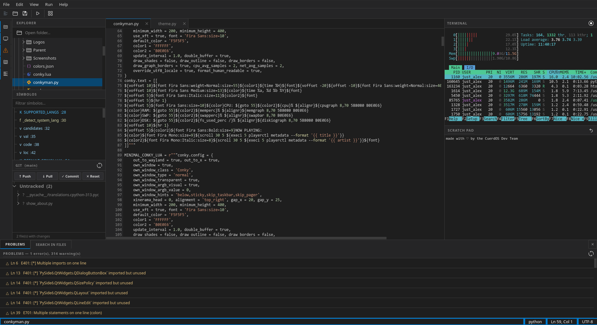

#  Suri Studio




> **Note:**
> Suri Studio is in early development. Features and APIs may change between releases.
> If you encounter a bug, please open an issue on GitHub.

## What is Suri Studio?

**Suri Studio** is a free and open source integrated development environment built with Python and PySide6. It provides syntax highlighting, live linting, autocompletion, an integrated git client, code execution, and a full PTY terminal, all in a single window, with no external runtime dependencies beyond Python and PySide6.

Suri Studio is developed as part of the [CuerdOS](https://github.com/CuerdOS) project and targets Linux desktop environments, with additional support for macOS and Windows.

## Features

### Editor
- Syntax highlighting for 18 languages: Python, JavaScript, TypeScript, HTML, CSS/SCSS, C, C++, Java, Rust, Go, Bash, JSON, TOML, YAML, Markdown, Ruby, PHP, Kotlin and Lua
- Automatic language detection by file extension and filename (`Makefile`, `Dockerfile`, `Gemfile`)
- Document-word autocompletion with built-in and user-defined snippets per language
- Live linting with margin markers and inline tooltips: ruff/pyflakes (Python), eslint (JS/TS), shellcheck (Bash), rubocop (Ruby), stylelint (CSS/SCSS)
- Find and Replace with regex, case-sensitive and whole-word modes
- Go to line, navigate back/forward through cursor history, bookmarks
- Split editor with two panes side by side
- Bracket matching, occurrence highlighting, current-line highlight
- Indent and dedent selection, duplicate line, move line up/down, toggle comment
- Word wrap toggle, font size adjustment

### Execution
- Run interpreted files directly in the integrated terminal: Python, JavaScript, TypeScript, Ruby, PHP, Lua, Bash, Go, Perl
- Compile and run for C, C++, Java, Rust and Kotlin via gcc, g++, javac, rustc, kotlinc
- Open HTML, SVG, Markdown and PDF files in the system browser

### Terminal
- Full pseudo-terminal (PTY): programs receive a real TTY, so `isatty()` returns true
- Interactive programs work correctly: `vim`, `htop`, `less`, `man`, `nano` and any ncurses application
- Alternate screen support (smcup/rmcup) required by vim, htop and similar tools
- ANSI 16-color, 256-color and true-color RGB rendering
- Dynamic resize: shell and programs receive `SIGWINCH` and adapt automatically
- `TERM=xterm-256color`, `COLORTERM=truecolor`
- Fallback to basic mode when `pyte`/`ptyprocess` are not installed

### Git
- Repository status: modified, untracked and staged files
- Per-file diff viewer
- Commit, push, pull and reset from the sidebar panel
- Automatic repository detection when navigating the file tree

### Session and workspace
- Full session persistence: open tabs and cursor positions are restored on next launch
- Autosave snapshots every 30 seconds, cleared on clean exit
- File tree with project folder navigation
- Symbols panel: classes, functions and methods with line numbers, filterable by text
- Search in files across the open folder with clickable results
- Command palette with access to all actions (`Ctrl+P`)
- Scratch pad with persistent content

### Interface
- 11 UI languages: Spanish, English, German, French, Portuguese, Japanese, Korean, Catalan, Italian, Turkish and Russian
- Embedded menu on Wayland compositors without Global Menu support (LabWC, sway, Hyprland); native menu preserved on KDE Plasma and macOS
- HiDPI and fractional scaling support

## Requirements

- **Python 3.10+**
- **PySide6**
- **pyte** · **ptyprocess** — required for the PTY terminal

Linters are optional. Install only the ones relevant to your workflow:

| Language | Tool |
|---|---|
| Python | `ruff` or `pyflakes` |
| JavaScript / TypeScript | `eslint` |
| Bash | `shellcheck` |
| Ruby | `rubocop` |
| CSS / SCSS | `stylelint` |

## Installation

Clone the repository:

```bash
git clone https://github.com/Just-Alex22/SuriStudio.git
cd SuriStudio
```

Install Python dependencies:

```bash
# Void Linux 
sudo xbps-install python3 python3-pip python3-pyside6
pip install pyte ptyprocess --break-system-packages

# Debian / CuerdOS
sudo apt install python3 python3-pip python3-pyside6
pip install pyte ptyprocess --break-system-packages

# Fedora / Nobara
sudo dnf install python3 python3-pip python3-pyside6
pip install pyte ptyprocess --break-system-packages

# Arch Linux / EndeavourOS
sudo pacman -S python3 python3-pip python3-pyside6
pip install pyte ptyprocess --break-system-packages

# macOS
brew install python
pip install pyside6 pyte ptyprocess

# Windows
pip install pyside6 pyte ptyprocess
```

Run:

```bash
python3 main.py
```

## Keyboard Shortcuts

| Action | Shortcut |
|---|---|
| New file | `Ctrl+N` |
| Open file | `Ctrl+O` |
| Save | `Ctrl+S` |
| Save as | `Ctrl+Shift+S` |
| Close tab | `Ctrl+W` |
| Run | `F5` |
| Build | `F6` |
| Command palette | `Ctrl+P` |
| Find / Replace | `Ctrl+F` |
| Search in files | `Ctrl+Shift+F` |
| Go to line | `Ctrl+G` |
| Toggle comment | `Ctrl+/` |
| Duplicate line | `Ctrl+D` |
| Move line up / down | `Alt+Up / Alt+Down` |
| Toggle sidebar | `Ctrl+B` |
| Split editor | `Ctrl+\` |
| Git panel | `Ctrl+Shift+G` |
| Symbols panel | `Ctrl+Shift+O` |
| Problems panel | `Ctrl+Shift+M` |
| Navigate back / forward | `Alt+Left / Alt+Right` |
| Bookmarks | `F7 / Ctrl+F7 / Shift+F7` |
| Increase / decrease font size | `Ctrl+= / Ctrl+-` |

## Contributing

If you want to collaborate with the development of **Suri Studio**, follow us on GitHub and send your **Pull Requests** and **Issues** through the repository.

## License

This program comes with the MIT license; consult https://www.mit.edu/~amini/LICENSE.md for more information.

---

> **Development:** [Just_Alex](https://github.com/Just-Alex22) 
